# OCI AI Data Platform

## 🎯 **Objetivos**

O objetivo desse workshop é prover uma experiência de uso do OCI Data Science, OCI Data Flow, Autonomous e Object Storage como plataforma de dados serverless para experimentação e desenvolvimento de projetos spark diversos

O que você aprenderá:
- Preparar a infraestrutura do OCI Data Science, OCI Data Flow, Oracle Autonomous e Object Storage para trabalharem de forma integrada.
- Criar e configurar ambiente de desenvolvimento dentro do OCI Data Science com o propósito de desenvolvimento de aplicações spark.
- Criar e manipular o OCI Data Flow utilizando o OCI Data Science
- Extrair dados de uma API e criar estrutura parquet em Object Storage seguindo boas práticas de performance.
- Interagir com o Oracle Autonomous afim de realizar leitura e escrita de datasets
- Como debugar e interagir com o OCI Data Flow runs, Spark UI e Autonomous
- Como construir aplicações spark compatíveis com o OCI Data Flow

### _**Aproveite sua experiência na Oracle Cloud!**_

## **1️⃣ Preparação da infraestrutura**

Antes de iniciar o Hands On, prepare os recursos necessários:

1.  Crie os recursos do **OCI Data Science**.

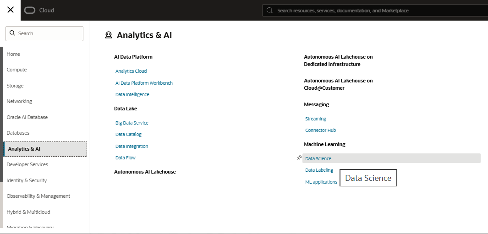

Crie um projeto chamado `DS01`

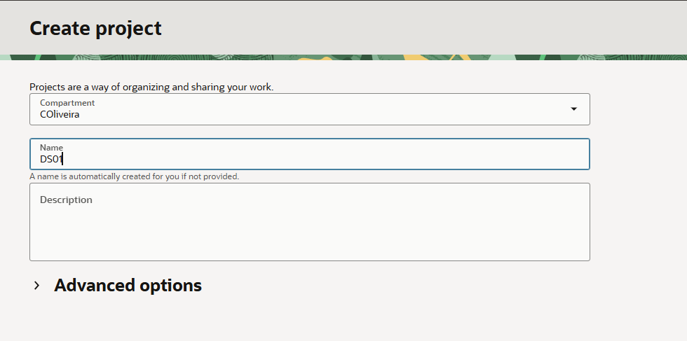

Clique em notebook sessions e crie uma sessão chamada `ds-session01`. Vá dando next e aceitando as configurações default

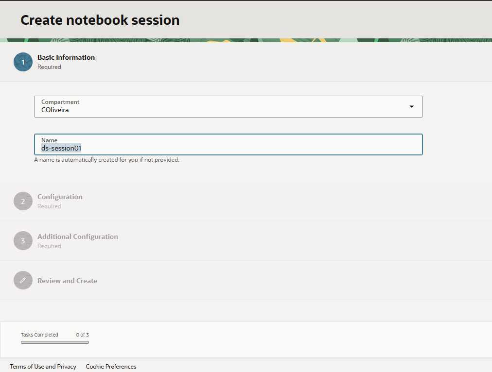

Deixe o ambiente criando e podemos seguir para a próxima etapa

2.  Crie os recursos do **OCI Object Storage**.

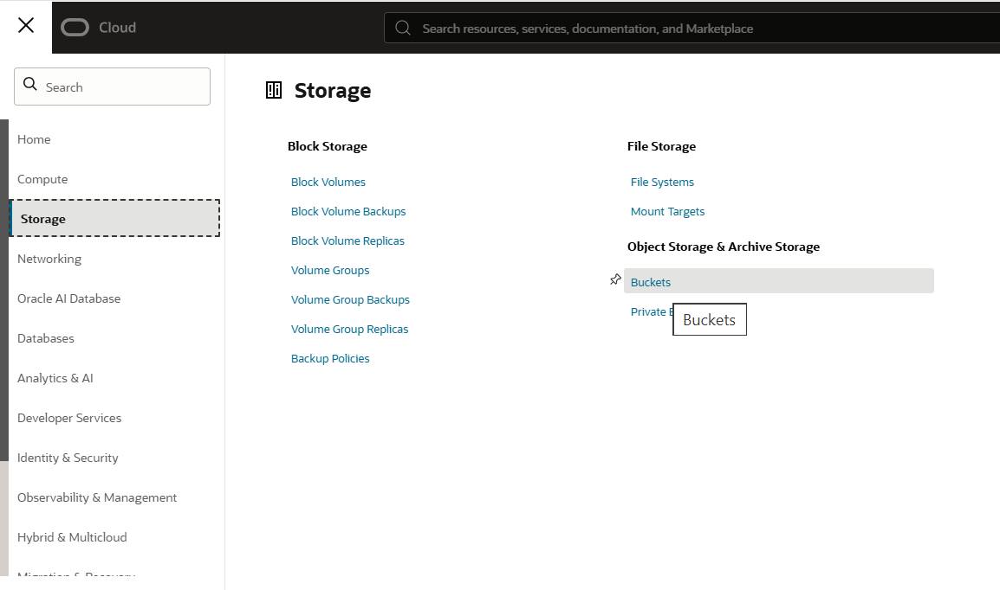

Temos que criar 4 buckets standard:
- `spark_lib`: repositório escolhido para armazenar binários e archives.zip
- `spark_logs`: repositório escolhido para armazenar logs de execuções do OCI Data Flow
- `spark_apps`: repositório escolhido para armazenar aplicações OCI Data Flow
- `data_bronze`: repositório escolhido para armazenar os arquivos parquet da camada bronze do nosso pipeline

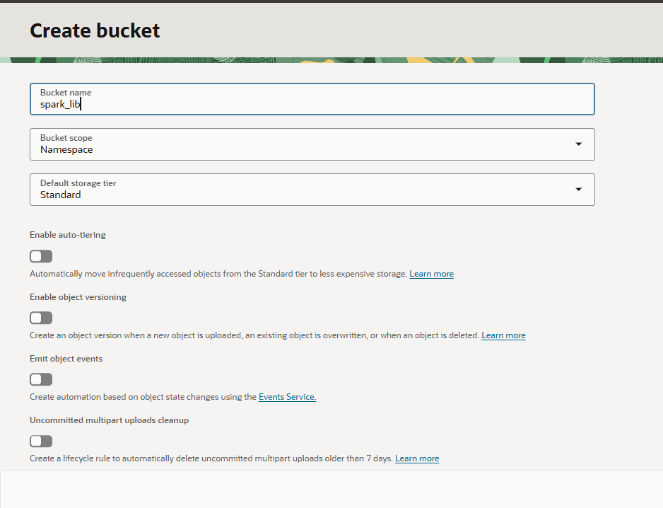

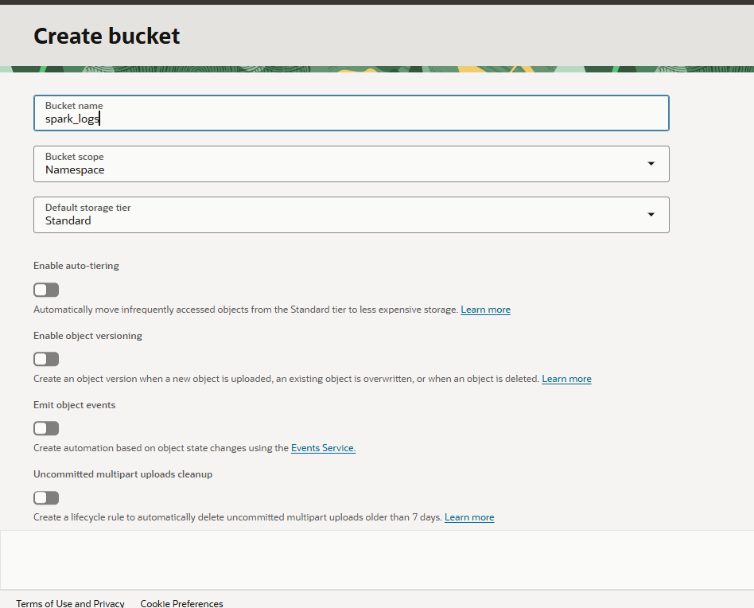

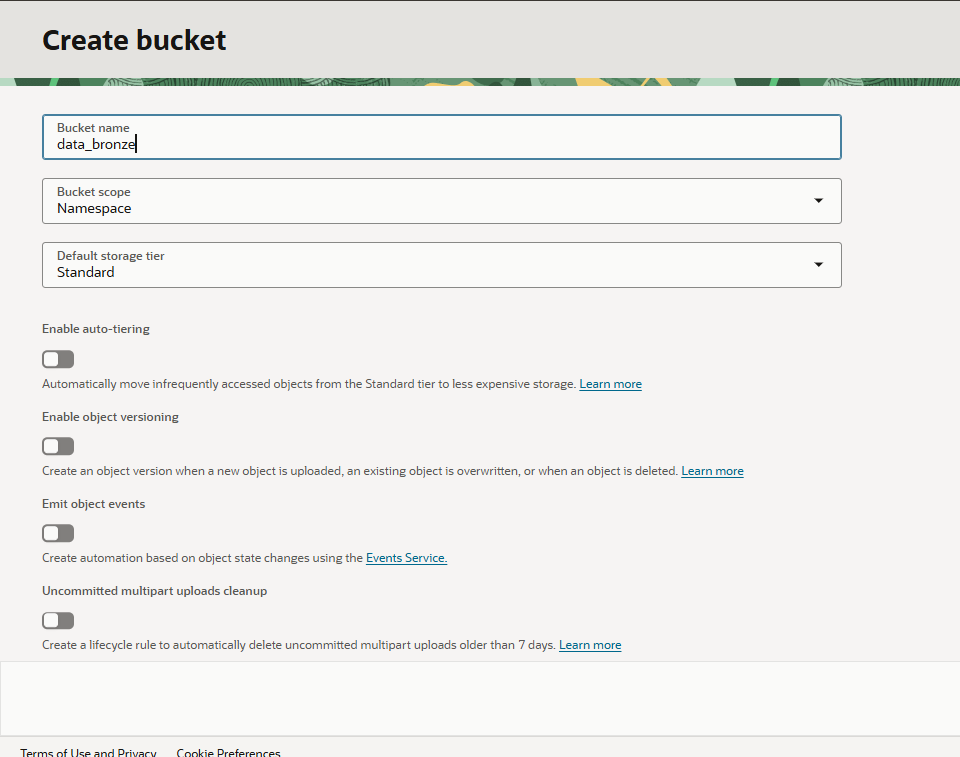

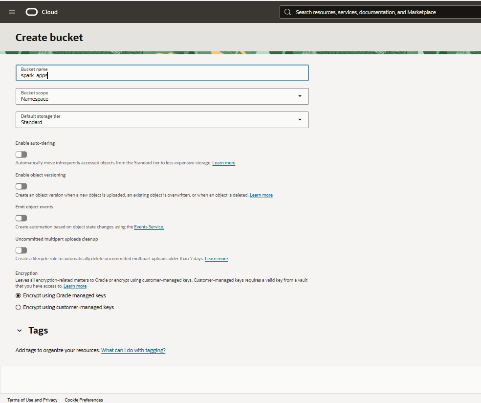

3.  Crie os recursos do **Oracle Autonomous DB**.

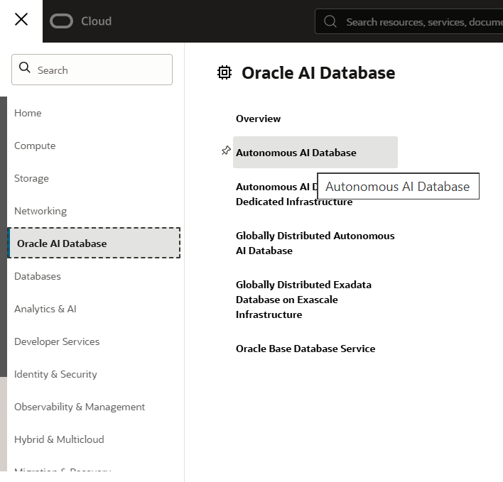

Crie um autonomous database com o nome `adb01`. Escolha a o **workload type como Lakehouse, a versão 26ai e use a senha WORKSHOPsec2019##**

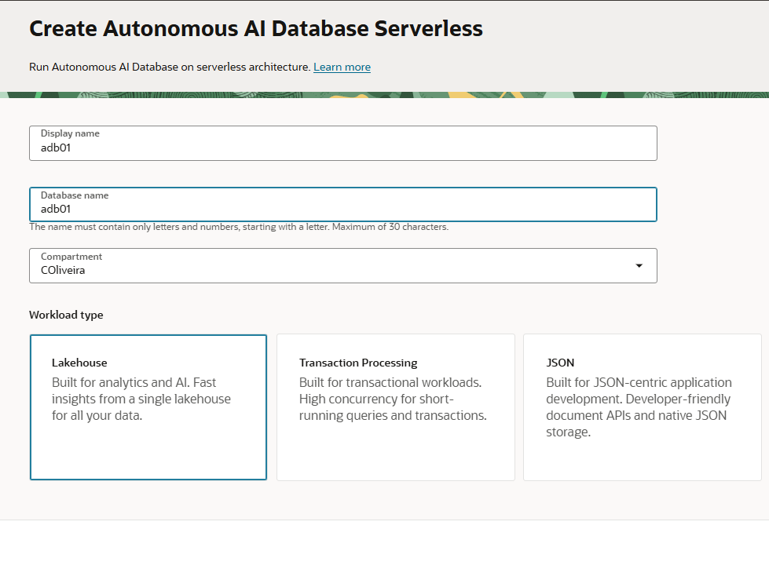

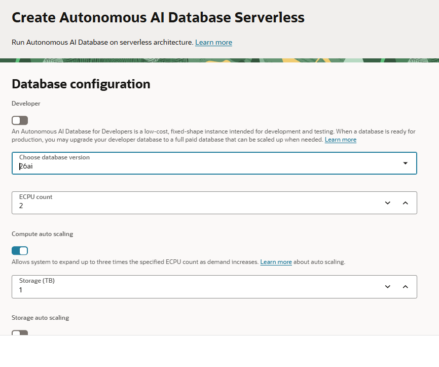

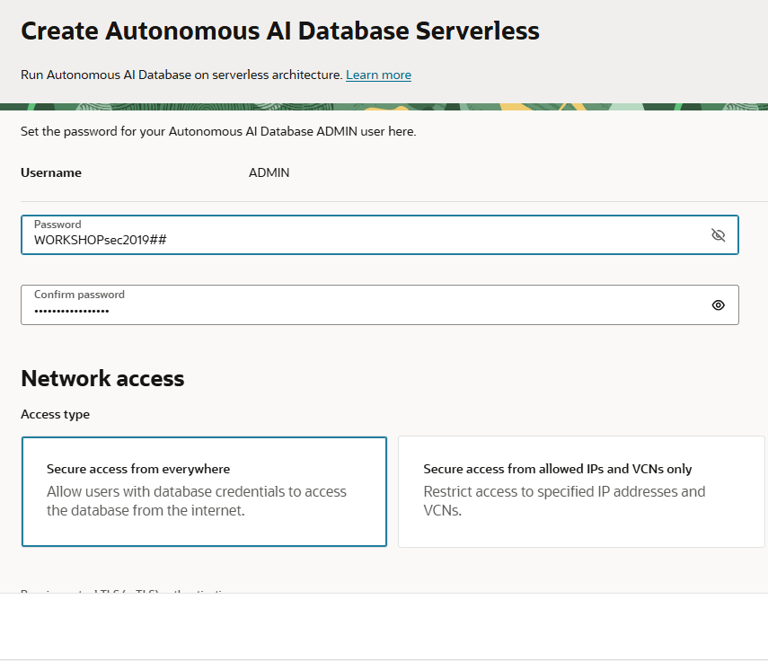

4.  Inicie o Hands On.

## **2️⃣ Configurando ambiente data science**

Nessa etapa faremos a configuração do nosso notebook session (data science) instalando o conde environment e realizando a atualização do ambiente no geral

Retorne ao Data Science


**Clique no projeto DS01, vá me notebook sessions, clique em ds-session01 e no botão open no canto superior direito da tela**

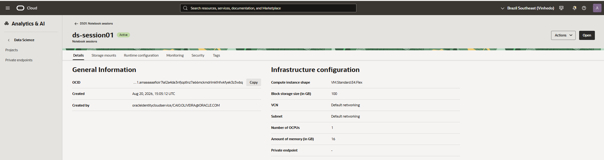

Uma vez dentro do nosso ambiente OCI Data Science, clicamos em environment explorer

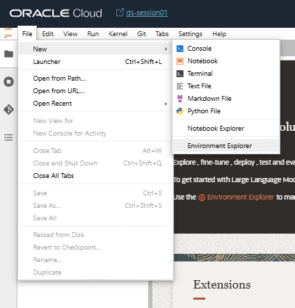

Busque por pyspark 3.5 and data flow, clique em install e aguarde a conclusão

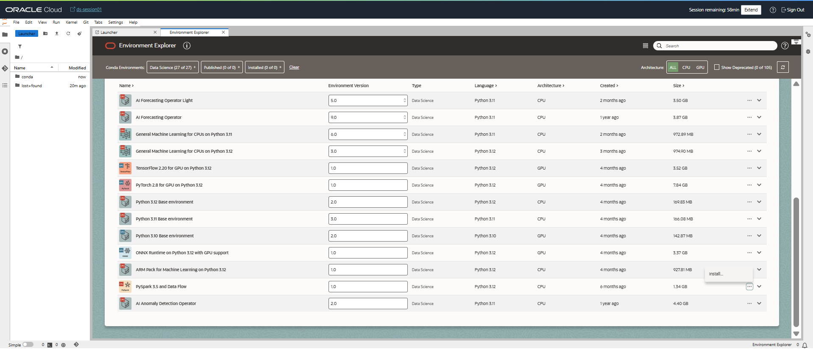

A instalação terá sido concluida quando a seguinte mensagem for apresentada na tela

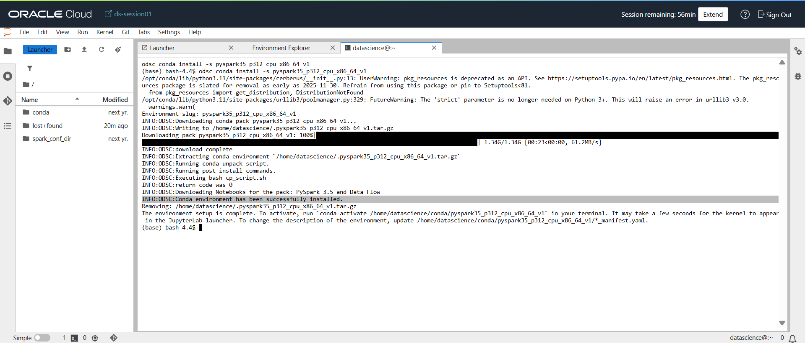

Agora clique com o botão direito e crie um novo notebook

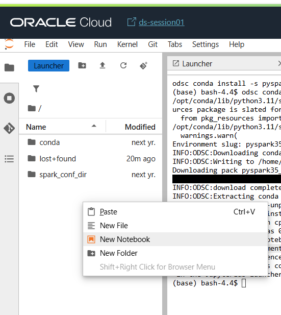

Escolha o kernel pyspark conforme o print

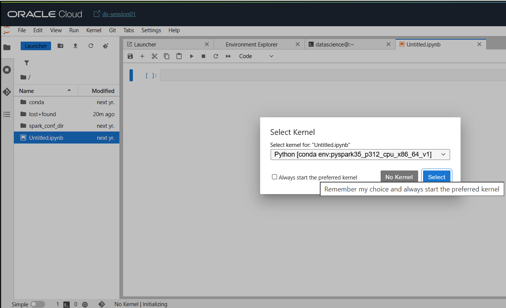

Agora faremos a atualização do ambiente, no primeiro parágrafo copie e cole o conteudo abaixo

```python
!pip install -U oracle-ads ipywidgets jupyter
```

Clique dentro do parágrafo e aperte crtl + enter para executá-lo

Aguarde a conclusão da instalação


Clique no icone do canto direito insert a cell bellow

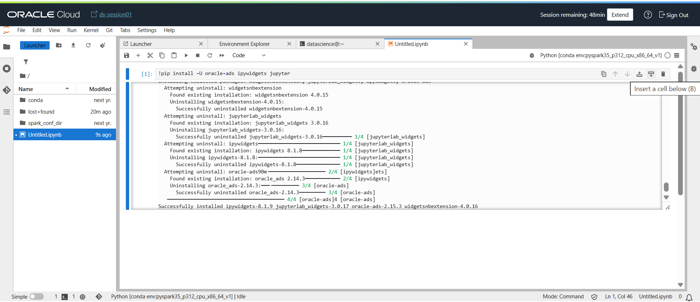

Agora faremos a criação de cluster spark do tipo session, copie e cole o conteudo abaixo dentro do parágrafo adicionado

```python
import os
import json
import ads
import oci
import json
from oci.auth.signers import get_resource_principals_signer
ads.set_auth("resource_principal")
def prepare_command(command: dict) -> str:
    """Converts dictionary command to the string formatted commands."""
    return f"'{json.dumps(command)}'"

signer = get_resource_principals_signer()
ocid_compartment = os.environ.get("NB_SESSION_COMPARTMENT_OCID")
object_storage_client = oci.object_storage.ObjectStorageClient(config={}, signer=signer)
namespace = object_storage_client.get_namespace().data
list_buckets_response = object_storage_client.list_buckets(namespace, ocid_compartment)
bucket_logs = "spark_logs"

print(ocid_compartment)
print(namespace)
print(bucket_logs)

%load_ext dataflow.magics

command = prepare_command(
    {
        "compartmentId": ocid_compartment,
        "displayName": "App Data Science Session",
        "language": "PYTHON",
        "sparkVersion": "3.5.0",
        "numExecutors": 1,
        "driverShape": "VM.Standard.E5.Flex",
        "executorShape": "VM.Standard.E5.Flex",
        "driverShapeConfig": {"ocpus": 1, "memoryInGBs": 16},
        "executorShapeConfig": {"ocpus": 1, "memoryInGBs": 16},
        "type": "SESSION",
        "logsBucketUri": f"oci://{bucket_logs}@{namespace}",
        "configuration": {
            "spark.oracle.datasource.enabled": "true", 
        },
    }
)

%create_session -l python -c $command

##%use_session -s "TROCAR_AQUI_DATA_FLOW_OCID"
```

Aperte ctrl + enter e execute o código para criação da aplicação data flow do tipo session, aguarde a criação. Concluida a criação teremos o seguinte output, informando o OCI da aplicação Data Flow

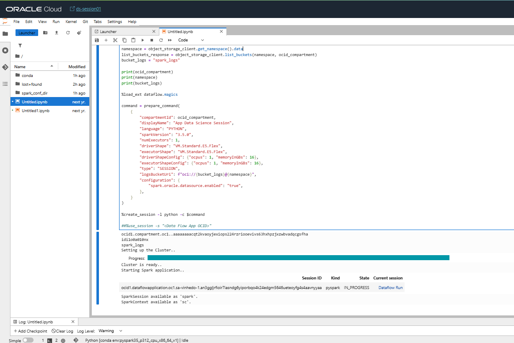

Caso a sua conexão caia ou já exista uma aplicação data flow previamente criada, não há necessidade de rodar o parágrafo acima novamente, basta você abrir um novo parágrafo e rodar o comando ```##%use_session -s "TROCAR_AQUI_DATA_FLOW_OCID" ``` substituindo a variável ```TROCAR_AQUI_DATA_FLOW_OCID```. Usando meu exemplo ficaria ```%use_session -s "ocid1.dataflowapplication.oc1.sa-vinhedo-1.an3ggljrfioir7iasndg6yiporbqo4k24edgm5646ueteoyfg4s4aavnyyaa"```

Agora estamos prontos para começar a montar e codar o nosso pipeline

## **3️⃣ Criação da aplicação data flow app_bronze**

Agora adicione um novo parágrafo no notebook, copie e cole o código abaixo, alterando o TROCAR_AQUI_PELO_SEU_NAMESPACE. No output do log de criação temos o namespace, no meu exemplo é ```idi1o0a010nx```

```python
%%time
%%spark
################################
## NOME APLICAÇÃO: APP_BRONZE ##
################################
import urllib.request
from pyspark.sql import SparkSession

spark = SparkSession.builder.appName("App_Bronze").getOrCreate()

orders_url = ("https://raw.githubusercontent.com/caiogusto2/workshop-adex-dataflow/main/lab/arquivos_csv/orders.csv")
customers_url = ("https://raw.githubusercontent.com/caiogusto2/workshop-adex-dataflow/main/lab/arquivos_csv/customers.csv")

base_path = "oci://data_bronze@TROCAR_AQUI_PELO_SEU_NAMESPACE/parquet"

orders_path = f"{base_path}/orders"
customers_path = f"{base_path}/customers"

with urllib.request.urlopen(orders_url) as response:orders_content = response.read().decode("utf-8")
with urllib.request.urlopen(customers_url) as response:customers_content = response.read().decode("utf-8")

df_orders = (
    spark.read
    .option("header", "true")
    .option("inferSchema", "true")
    .option("sep", ";")
    .csv(spark.sparkContext.parallelize(orders_content.splitlines()))
)

df_customers = (
    spark.read
    .option("header", "true")
    .option("inferSchema", "true")
    .option("sep", ";")
    .csv(spark.sparkContext.parallelize(customers_content.splitlines()))
)

df_orders.write.mode("overwrite").parquet(orders_path)
df_customers.write.mode("overwrite").parquet(customers_path)

print("Parquet datasets created successfully:")
print(orders_path)
print(customers_path)
```
O seguinde output é esperado, caso tudo tenha rodado corretamente

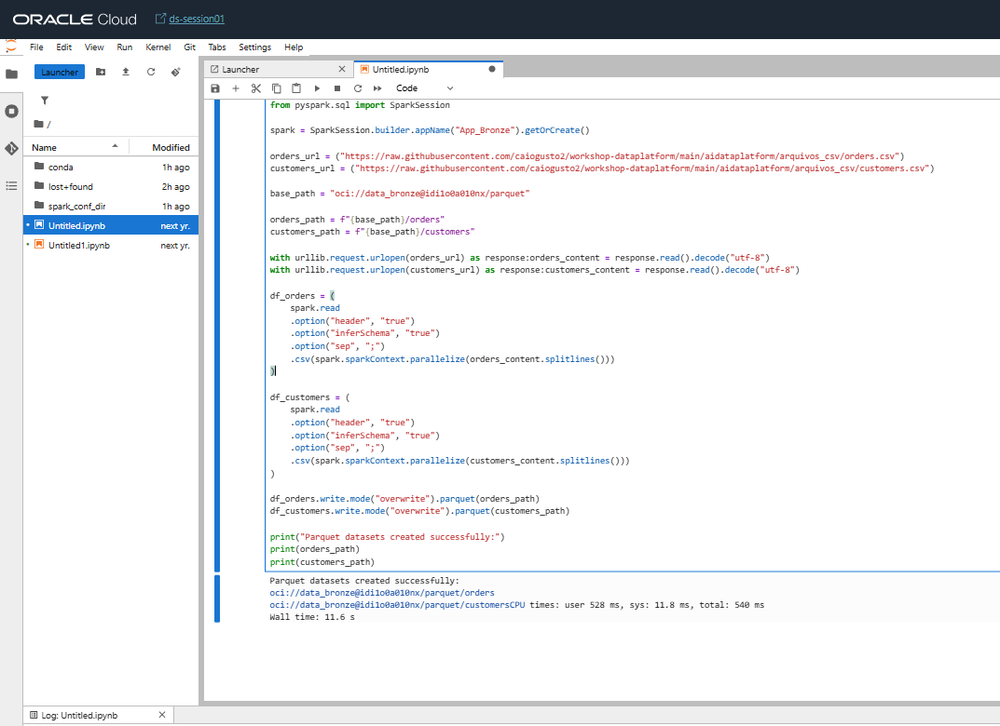

O %%time na parte de cima de nosso parágrafo adiciona o tempo de execução e o %%spark indica o nosso parágrafo a usar a conexão existente com o cluster data flow do tipo session que esta online

### **➡️ Análise exploratória da camada Bronze**

A nossa aplicação data flow app_bronze esta pronta, agora vamos criar um novo parágrafo afim de realizarmos algumas análises exploratórias sobre esses datasets recém importados para o OCI

Copie e cole o código abaixo e faça a alteração do namespace conforme indicação. TROCAR_AQUI_PELO_SEU_NAMESPACE

```python
%%time
%%spark
#################################
## NOME APLICAÇÃO: ANALISE SQL ##
#################################
orders_path = "oci://data_bronze@TROCAR_AQUI_PELO_SEU_NAMESPACE/parquet/orders"
customers_path = "oci://data_bronze@TROCAR_AQUI_PELO_SEU_NAMESPACE/parquet/customers"

orders_df = spark.read.parquet(orders_path)
customers_df = spark.read.parquet(customers_path)

orders_df.createOrReplaceTempView("orders")
customers_df.createOrReplaceTempView("customers")

print("=== DESCRIBE TABLE: orders ===")
spark.sql("DESCRIBE TABLE orders").show(200, truncate=False)

print("=== DESCRIBE TABLE: customers ===")
spark.sql("DESCRIBE TABLE customers").show(200, truncate=False)

print("=== SAMPLE: orders ===")
spark.sql("SELECT * FROM orders LIMIT 10").show(10, truncate=False)

print("=== SAMPLE: customers ===")
spark.sql("SELECT * FROM customers LIMIT 10").show(10, truncate=False)

print("=== ORDERS DATA QUALITY ===")
spark.sql("""
SELECT
  COUNT(*) AS row_count,
  SUM(CASE WHEN CUSTOMER_ID IS NULL THEN 1 ELSE 0 END) AS customer_id_nulls,
  SUM(CASE WHEN ORDER_ID IS NULL THEN 1 ELSE 0 END) AS order_id_nulls,
  SUM(CASE WHEN ORDER_DATE IS NULL THEN 1 ELSE 0 END) AS order_date_nulls,
  SUM(CASE WHEN ORDER_TOTAL IS NULL THEN 1 ELSE 0 END) AS order_total_nulls,
  SUM(CASE WHEN COST_OF_DELIVERY IS NULL THEN 1 ELSE 0 END) AS cost_of_delivery_nulls,
  MIN(ORDER_TOTAL) AS min_order_total,
  MAX(ORDER_TOTAL) AS max_order_total,
  AVG(ORDER_TOTAL) AS avg_order_total,
  MIN(COST_OF_DELIVERY) AS min_cost_of_delivery,
  MAX(COST_OF_DELIVERY) AS max_cost_of_delivery,
  AVG(COST_OF_DELIVERY) AS avg_cost_of_delivery
FROM orders
""").show(truncate=False)

print("=== CUSTOMERS DATA QUALITY ===")
spark.sql("""
SELECT
  COUNT(*) AS row_count,
  SUM(CASE WHEN CUSTOMER_ID IS NULL THEN 1 ELSE 0 END) AS customer_id_nulls,
  SUM(CASE WHEN CUST_FIRST_NAME IS NULL THEN 1 ELSE 0 END) AS cust_first_name_nulls,
  SUM(CASE WHEN CUST_LAST_NAME IS NULL THEN 1 ELSE 0 END) AS cust_last_name_nulls,
  SUM(CASE WHEN CUST_EMAIL IS NULL THEN 1 ELSE 0 END) AS cust_email_nulls,
  SUM(CASE WHEN CREDIT_LIMIT IS NULL THEN 1 ELSE 0 END) AS credit_limit_nulls,
  MIN(CREDIT_LIMIT) AS min_credit_limit,
  MAX(CREDIT_LIMIT) AS max_credit_limit,
  AVG(CREDIT_LIMIT) AS avg_credit_limit
FROM customers
""").show(truncate=False)

print("=== DUPLICATE ORDERS ===")
spark.sql("""
SELECT CUSTOMER_ID, ORDER_ID, COUNT(*) AS cnt
FROM orders
GROUP BY CUSTOMER_ID, ORDER_ID
HAVING COUNT(*) > 1
ORDER BY cnt DESC
""").show(truncate=False)

print("=== DUPLICATE CUSTOMERS ===")
spark.sql("""
SELECT CUSTOMER_ID, COUNT(*) AS cnt
FROM customers
GROUP BY CUSTOMER_ID
HAVING COUNT(*) > 1
ORDER BY cnt DESC
""").show(truncate=False)
```

Rodando com sucesso teremos a análise exploratória conforme o print abaixo

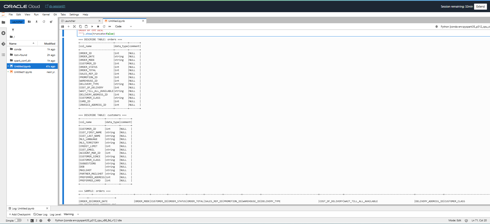

## **4️⃣ Criação da aplicação data flow app_silver**

Agora para a camada silver começaremos a interagir com o Autonomous Database, faremos a leitura do arquivo parquet, seguido de um join e por fim a escrita dentro de nosso autonomous

Antes de iniciarmos, vá na guia do OCI e siga até o seu Autonomous


Clique no Autonomous DB criado anteriormente, depois em **Database Connection** e por fim faça o download da wallet. Use a senha **WORKSHOPsec2019##**

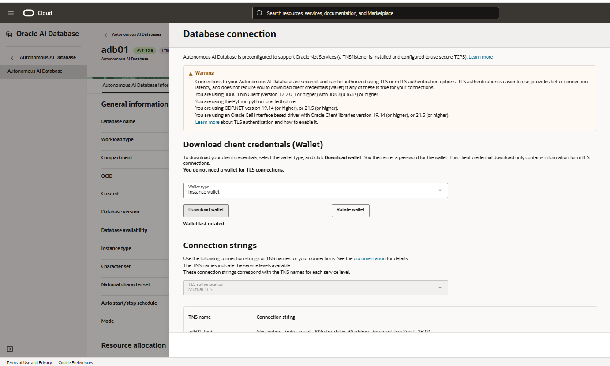

Agora vamos fazer o upload do arquivo Wallet_adb.zip para o nosso bucket ```spark_lib```


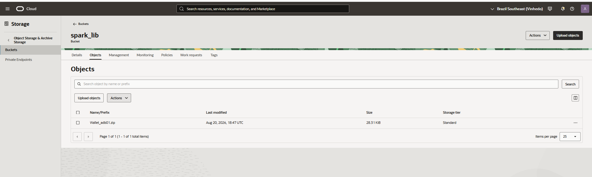

Copie e cole o conteudo abaixo e faça a alteração da variável TROCAR_AQUI_PELO_SEU_NAMESPACE

```python
%%time
%%spark
################################
## NOME APLICAÇÃO: APP_SILVER ##
################################
from pyspark.sql import functions as F
from pyspark.sql import SparkSession
import base64
import urllib.request

spark = SparkSession.builder.appName("App_Silver").getOrCreate()


oss_path = "oci://data_bronze@TROCAR_AQUI_PELO_SEU_NAMESPACE"
wallet_path = "oci://spark_lib@TROCAR_AQUI_PELO_SEU_NAMESPACE"

base_path = f"{oss_path}/parquet"
catalog_location = f"{oss_path}/staging"

orders_path = f"{base_path}/orders"
customers_path = f"{base_path}/customers"

# Wallet no Object Storage
wallet_uri = f"{wallet_path}/Wallet_adb01.zip"

# Oracle ADB / AI Lakehouse
alh_tns = "adb01_high"
alh_user = "ADMIN"
alh_password = "WORKSHOPsec2019##"
alh_schema = "ADMIN"
target_table = "CUSTOMERS_ORDERS"

df_orders = spark.read.parquet(orders_path)
df_customers = spark.read.parquet(customers_path)

print(f"Orders:    {df_orders.count()}")
print(f"Customers: {df_customers.count()}")

df_join = (
    df_orders.alias("o")
    .join(
        df_customers.alias("c"),
        on="CUSTOMER_ID",
        how="inner"
    )
)

silver_df = df_join.select(
    F.col("CUSTOMER_ID"),
    F.col("ORDER_ID"),
    F.col("ORDER_DATE"),
    F.col("ORDER_MODE"),
    F.col("ORDER_STATUS"),
    F.col("ORDER_TOTAL"),
    F.col("SALES_REP_ID"),
    F.col("PROMOTION_ID"),
    F.col("WAREHOUSE_ID"),
    F.col("DELIVERY_TYPE"),
    F.col("COST_OF_DELIVERY"),
    F.col("WAIT_TILL_ALL_AVAILABLE"),
    F.col("DELIVERY_ADDRESS_ID"),
    F.col("o.CUSTOMER_CLASS").alias("ORDER_CUSTOMER_CLASS"),
    F.col("CARD_ID"),
    F.col("INVOICE_ADDRESS_ID"),
    F.col("CUST_FIRST_NAME"),
    F.col("CUST_LAST_NAME"),
    F.col("NLS_LANGUAGE"),
    F.col("NLS_TERRITORY"),
    F.col("CREDIT_LIMIT"),
    F.col("CUST_EMAIL"),
    F.col("ACCOUNT_MGR_ID"),
    F.col("CUSTOMER_SINCE"),
    F.col("c.CUSTOMER_CLASS").alias("CUSTOMER_CLASS"),
    F.col("SUGGESTIONS"),
    F.col("DOB"),
    F.col("MAILSHOT"),
    F.col("PARTNER_MAILSHOT"),
    F.col("PREFERRED_ADDRESS"),
    F.col("PREFERRED_CARD")
)

silver_df = (
    silver_df
    .withColumn(
        "ORDER_DATE",
        F.to_timestamp(
            F.trim(F.col("ORDER_DATE")),
            "dd-MMM-yy hh.mm.ss.SSSSSS a"
        )
    )
    .withColumn(
        "CUSTOMER_SINCE",
        F.to_date(
            F.trim(F.col("CUSTOMER_SINCE")),
            "dd-MMM-yy"
        )
    )
    .withColumn(
        "DOB",
        F.to_date(
            F.trim(F.col("DOB")),
            "dd-MMM-yy"
        )
    )
)

row_count = silver_df.count()
print(f"Silver row count: {row_count}")

silver_df.printSchema()
silver_df.show(10, truncate=False)
print("Carregando wallet...")

wallet_df = (
    spark.read
    .format("binaryFile")
    .load(wallet_uri)
)

wallet_rows = wallet_df.select("content").collect()

if len(wallet_rows) != 1:
    raise RuntimeError(
        f"Esperado exatamente 1 arquivo de wallet, "
        f"mas foram encontrados {len(wallet_rows)}."
    )

wallet_bytes = wallet_rows[0]["content"]

if not wallet_bytes:
    raise RuntimeError("wallet.zip está vazio.")

print(f"Wallet carregada: {len(wallet_bytes)} bytes")

wallet_content = (
    base64
    .b64encode(wallet_bytes)
    .decode("ascii")
)

print(
    f"Wallet convertida para Base64: "
    f"{len(wallet_content)} caracteres"
)

print(
    f"Gravando {row_count} linhas em "
    f"{alh_schema}.{target_table}..."
)

(
    silver_df.write
    .format("oracle") \
    .option("walletUri", wallet_uri) \
    .option("connectionId",alh_tns) \
    .option("dbtable", target_table) \
    .option("user", alh_user) \
    .option("password", alh_password) 
    .save()
)

print(
    f"Dados gravados com sucesso em "
    f"{alh_schema}.{target_table}"
)
```

Caso a execução tenha sido executada com sucesso, teremos o seguinte resultado

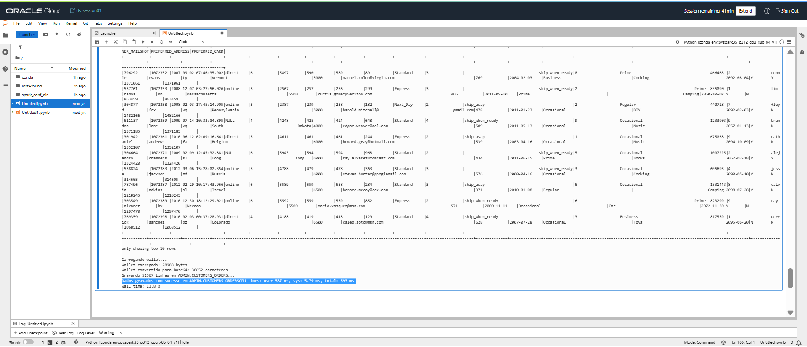

## **5️⃣ Criação da aplicação data flow app_gold**

Como última etapa de nosso processo, criaremos mais um parágrafo e criaremos um último report, lendo informações do Autonomous DB, realizando o processamento no spark e depois escrevendo novamente os resultados no autonomous db

Copie e cole o conteudo abaixo e faça a alteração da variável TROCAR_AQUI_PELO_SEU_NAMESPACE

```python
%%time
%%spark
################################
## NOME APLICAÇÃO: APP_GOLD ##
################################
from pyspark.sql import functions as F
from pyspark.sql import SparkSession
import base64
import urllib.request

spark = SparkSession.builder.appName("App_Gold").getOrCreate()

oss_path = "oci://bucket01@TROCAR_AQUI_PELO_SEU_NAMESPACE"
wallet_path = "oci://spark_lib@TROCAR_AQUI_PELO_SEU_NAMESPACE"

base_path = f"{oss_path}/parquet"
catalog_location = f"{oss_path}/staging"
wallet_uri = f"{wallet_path}/Wallet_adb01.zip"

alh_tns = "adb01_high"
alh_user = "ADMIN"
alh_password = "WORKSHOPsec2019##"
alh_schema = "ADMIN"

source_table = "CUSTOMERS_ORDERS"
gold_table = "CUSTOMER_CLASS_AGG_REVIEW"

print("Carregando wallet...")
wallet_df = (
    spark.read
    .format("binaryFile")
    .load(wallet_uri)
)

wallet_rows = wallet_df.select("content").collect()
if len(wallet_rows) != 1:
    raise RuntimeError(
        f"Esperado exatamente 1 arquivo de wallet, "
        f"mas foram encontrados {len(wallet_rows)}."
    )
wallet_bytes = wallet_rows[0]["content"]
if not wallet_bytes:
    raise RuntimeError("wallet.zip está vazio.")

print(f"Wallet carregada: {len(wallet_bytes)} bytes")
wallet_content = (
    base64
    .b64encode(wallet_bytes)
    .decode("ascii")
)
print(
    f"Wallet convertida para Base64: "
    f"{len(wallet_content)} caracteres"
)

print(
    f"Lendo {alh_schema}.{source_table} "
    "via AIDATAPLATFORM..."
)

df_silver = (
    spark.read
    .format("oracle") \
    .option("walletUri", wallet_uri) \
    .option("connectionId",alh_tns) \
    .option("dbtable", source_table) \
    .option("user", alh_user) \
    .option("password", alh_password) \
    .load()
)

print("=== SILVER DATA ===")
df_silver.printSchema()
source_count = df_silver.count()
print(
    f"{source_table} rows: {source_count}"
)

if source_count > 0:
    df_silver.select(
        "CUSTOMER_ID",
        "ORDER_ID",
        "ORDER_DATE",
        "ORDER_TOTAL",
        "CUSTOMER_CLASS"
    ).show(10, truncate=False)

else:
    print(
        f"{source_table} está vazio."
    )

df_silver = (
    df_silver
    .withColumn(
        "ORDER_TOTAL",
        F.col("ORDER_TOTAL").cast("decimal(18,2)")
    )
)

df_norm = (
    df_silver
    .withColumn(
        "CUSTOMER_CLASS_NORM",
        F.trim(
            F.regexp_replace(
                F.regexp_replace(
                    F.upper(
                        F.col("CUSTOMER_CLASS")
                    ),
                    u"\u00A0",
                    " "
                ),
                r"\s+",
                " "
            )
        )
    )
)

df_gold = (
    df_norm
    .groupBy("CUSTOMER_CLASS_NORM")
    .agg(
        F.count("ORDER_ID").alias("TOTAL_ORDERS"),

        F.round(
            F.sum("ORDER_TOTAL"),
            2
        ).alias("TOTAL_SALES"),

        F.round(
            F.avg("ORDER_TOTAL"),
            2
        ).alias("AVG_ORDER_VALUE")
    )
    .orderBy(
        F.col("TOTAL_ORDERS").desc()
    )
)

print("=== GOLD AGGREGATION ===")
df_gold.printSchema()
df_gold.show(truncate=False)
gold_count = df_gold.count()
print(
    f"Gold rows: {gold_count}"
)

if gold_count > 0:
    print(
        f"Gravando {gold_count} linhas em "
        f"{alh_schema}.{gold_table}..."
    )

    (
        df_gold.write
        .format("oracle")
        .mode("overwrite")
        .option("walletUri", wallet_uri) \
        .option("connectionId",alh_tns) \
        .option("dbtable", gold_table) \
        .option("user", alh_user) \
        .option("password", alh_password) 
        .save()
    )

    print(
        f"Gold gravada com sucesso em "
        f"{alh_schema}.{gold_table}"
    )

else:

    print(
        "Nenhum registro Gold foi produzido. "
        "A tabela Gold não será sobrescrita."
    )
```

Caso tenha executado com sucesso, teremos o seguinte output

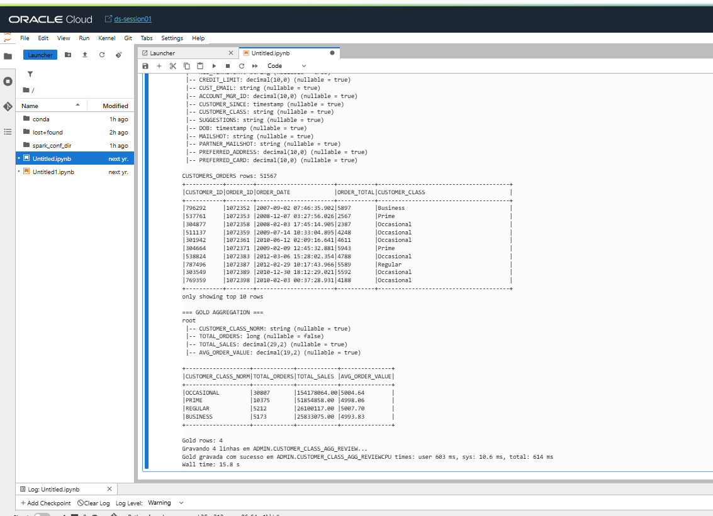

## **6️⃣ Debug e análise de performance Data Flow**

A forma recomendada para análise de performance do ambiente se dár através do OCI. Navegue ate a interface do OCI Data Flow

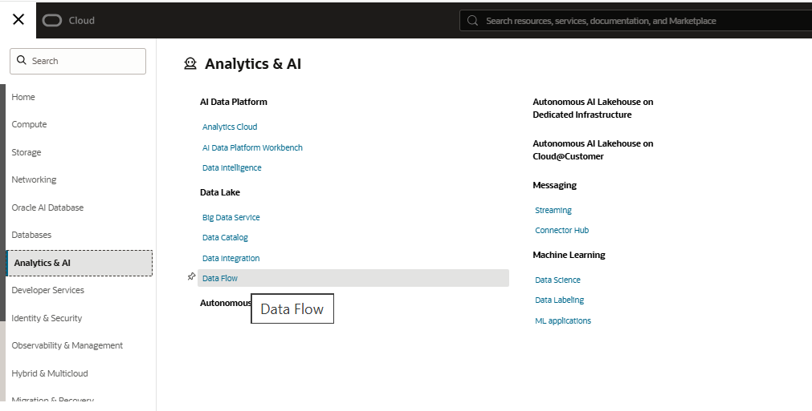

Na aba de applications veremos a nossa applicação criada pelo data science

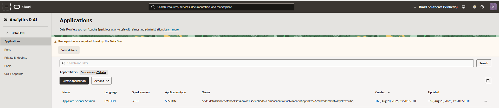

Clique nessa aplicação e depois em related runs. Veremos uma sessão no status `in progress`. 

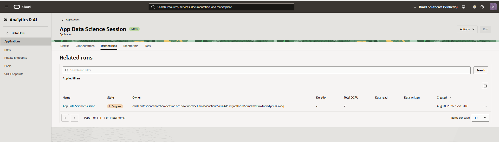

Essa sessão é a sessão que usamos durante todo o nosso workshop, clique nela

Clique em monitoring e explore a tela. Veja que teremos os logs do driver e executors ali presentes. Quando formos rodar um Data Flow como Batch ou Streaming, essa é a interface a ser acessada para consultar os erros de execução

Veja ainda que nessa tela temos o uso de CPU e Memória do nosso driver e executors. Uma métrica muito importante para debug


Clique em Spark UI

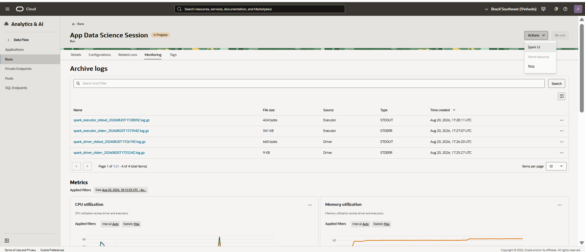

Na Spark UI conseguiremos avaliar o plano de execução, parametros de configuração do nosso ambiente e visualizar tasks que foram concluidas com sucesso. Navegue livremente pela console

**Jobs:** Dashboard principal onde irá mostrar as execuções ativas, com falha e em andamento

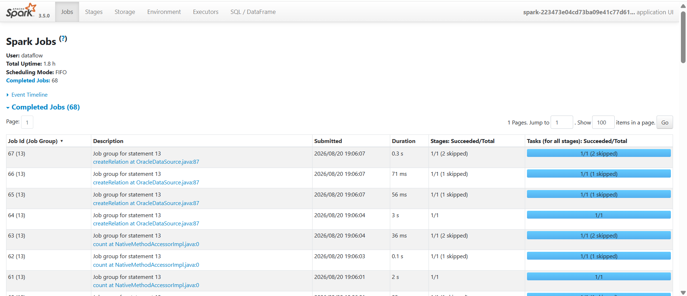

**Stages:** Apresenta informações detalhadas sobre algum job em específico, métricas de consumo, plano de execução e assim em diante. Clique em qualquer linha apresentada para ter detalhes

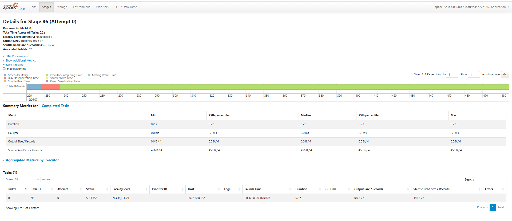

**Environment** Mostra as configurações ativas na infra estrutura spark

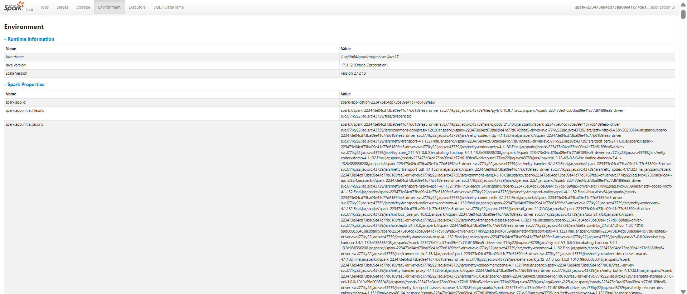

## **7️⃣ Publicação e deployment de aplicações spark para execução Batch**

Agora daremos um exemplo de publicação de código gerado no Data Science a ser executado no modo Batch no OCI Data Flow. 
- Crie um arquivo chamado `app_gold.py` no desktop do seu laptop. 
- Retorne ao Data Science, copie e cole o conteudo do último parágrafo no arquivo
- Delete as 5 primeiras linhas do arquivo, marcadas no print screen
- salve o arquivo

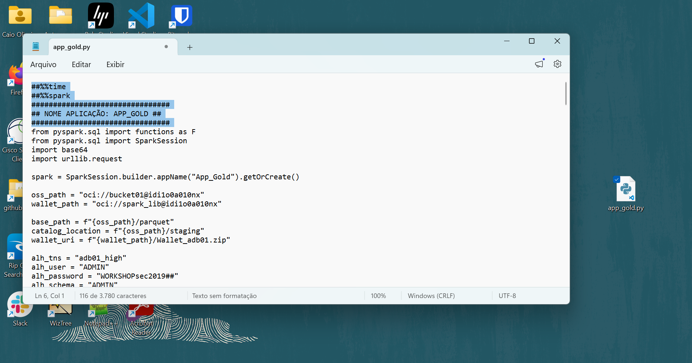

Agora no OCI navegue até o bucket chamado `spark_apps` e faça o upload do arquivo `app_gold.py`

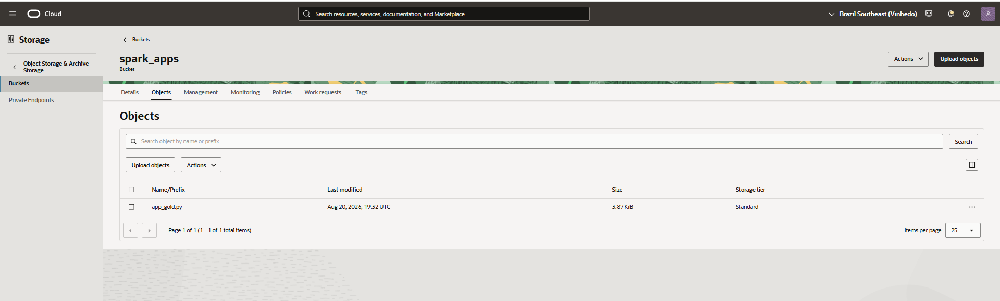

Navegue de volta a console do OCI Data Flow no OCI e clique em create application

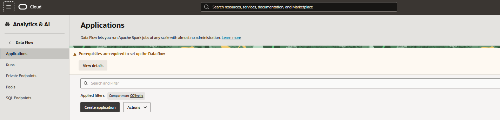

Faça o preenchimento de acordo com o exemplo abaixo, preenche os campos destacados abaixo, o resto aceito o default
- Dê o nome de `app_gold`
- Selecione python
- Selecione o seu arquivo `app_gold.py`
- Selecione `spark_lib` para o campo de archive uri
- No log location a pasta `spark_log`

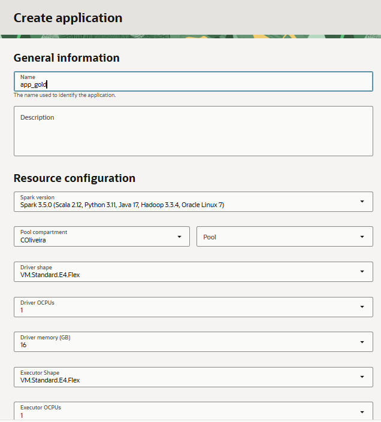

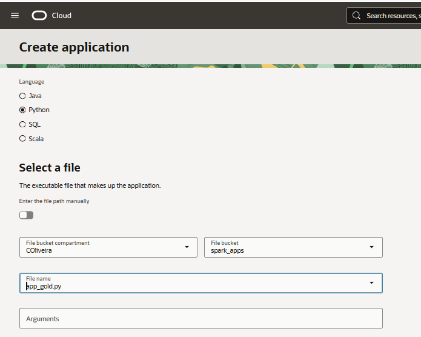

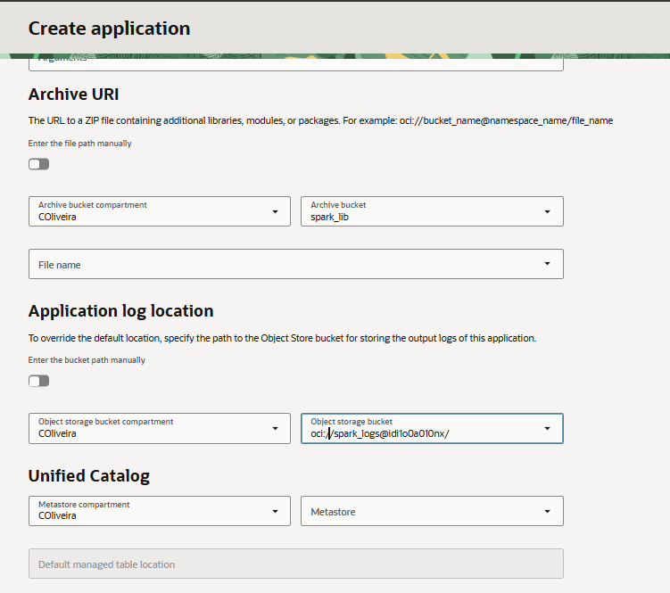

Clique em advanced options e marque a opção `enable spark oracle data source property`

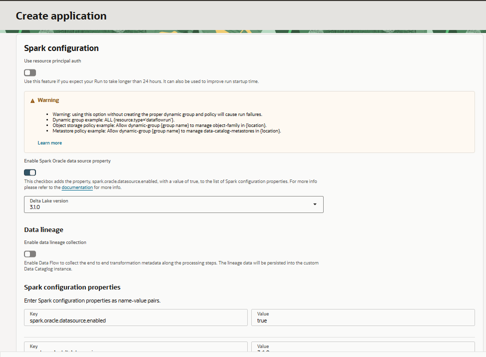

E clique em create

Clique no `app_gold` na tela seguinte e clique em run. Clique novamente em run, aceite todas as configurações default

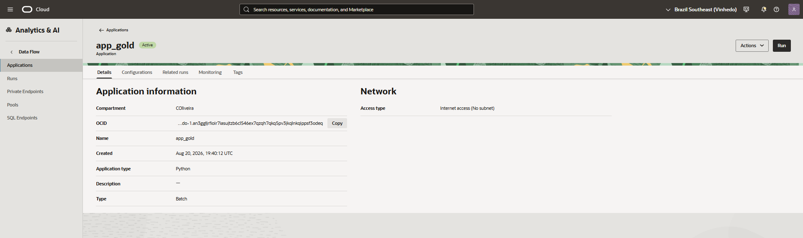

Clique em monitoring. 
- O status accepted indica que foi submetida a requisição e que esta na fila para execução.
- O status In Progress indica que esta sendo executado o script. 
- O status Succeded indica que foi executado com sucesso

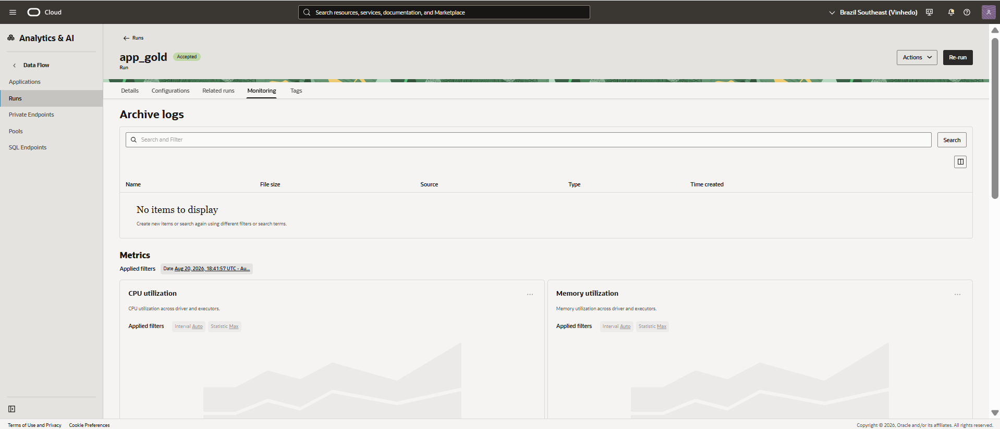

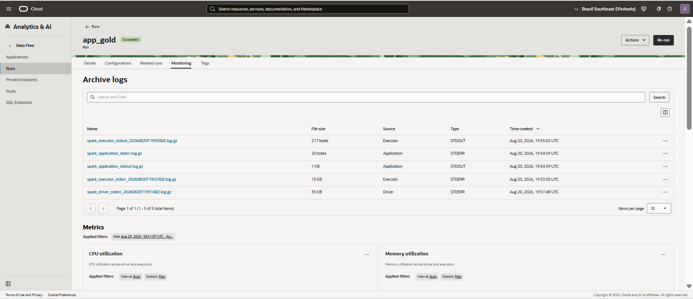

Clique nos logs, na spark UI, navegue e veja o conteudo dessa run

------------------------------------------------------------------------

## **✅ Laboratório finalizado!**

Parabéns! Você concluiu o hands-on do OCI AI Data Platform (AIDP), construindo as camadas Bronze, Silver e Gold, utilizando o Autonomous Database para persistência e consumo dos dados processados e adaptando a aplicação desenvolvida no AIDP para execução no OCI Data Flow.

Ao longo do laboratório, você passou pela preparação da infraestrutura, desenvolvimento e execução de aplicações PySpark, análise exploratória e qualidade dos dados, construção da arquitetura medalhão, integração com o Autonomous Database, utilização das ferramentas de monitoramento e debug do Spark e, por fim, reutilização do código desenvolvido no AIDP para deployment no OCI Data Flow.

Com isso, você percorreu um fluxo de desenvolvimento fim a fim, desde a experimentação e desenvolvimento no OCI AI Data Platform até a execução da aplicação Spark no OCI Data Flow.


## 👥 Agradecimentos

- **Autores** - Caio Oliveira
- **Autores Contribuintes** - Isabelle Anjos
- **Última atualização** - Agosto de 2026

## 🛡️ Declaração de Porto Seguro (Safe Harbor)

O tutorial apresentado tem como objetivo traçar a orientação dos nossos produtos em geral. É destinado somente a fins informativos e não pode ser incorporado a um contrato. Ele não representa um compromisso de entrega de qualquer tipo de material, código ou funcionalidade e não deve ser considerado em decisões de compra. O desenvolvimento, a liberação, a data de disponibilidade e a precificação de quaisquer funcionalidades ou recursos descritos para produtos da Oracle estão sujeitos a mudanças e são de critério exclusivo da Oracle Corporation.

Esta é a tradução de uma apresentação em inglês preparada para a sede da Oracle nos Estados Unidos. A tradução é realizada como cortesia e não está isenta de erros. Os recursos e funcionalidades podem não estar disponíveis em todos os países e idiomas. Caso tenha dúvidas, entre em contato com o representante de vendas da Oracle. 
